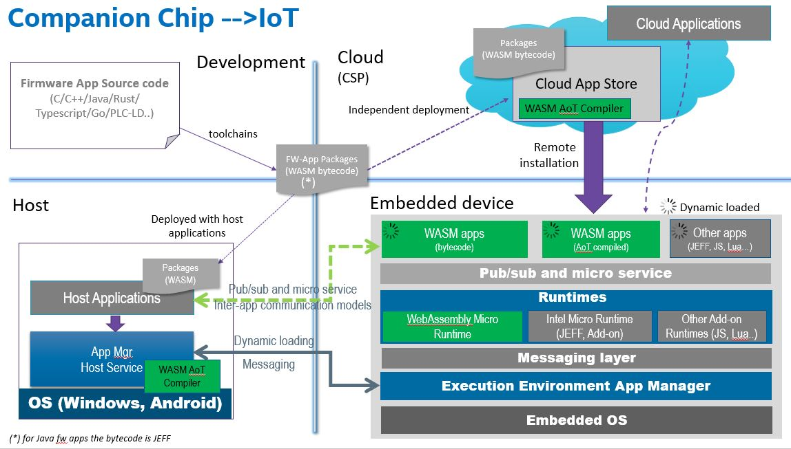
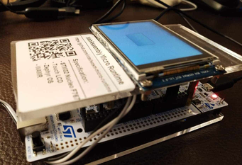

WebAssembly Micro Runtime
=========================
[Building WAMR VM core](./doc/build_wamr.md) | [Embedding WAMR VM core](./doc/embed_wamr.md) | [Building WASM applications](./doc/build_wasm_app.md) | [Samples and demos](https://github.com/bytecodealliance/wasm-micro-runtime#samples-and-demos)

**A [Bytecode Alliance][BA] project**

[BA]: https://bytecodealliance.org/

WebAssembly Micro Runtime (WAMR) is a standalone WebAssembly (WASM) runtime with small footprint. It includes a few parts as below:
- The "iwasm" VM core, supporting WebAssembly interpreter, ahead of time compilation (AoT) and Just-in-Time compilation (JIT)

- The application framework and the supporting API's for the WASM applications

- The dynamic management of the WASM applications


iwasm VM core
=========================

### key features

- Embeddable with the supporting C API's
- Small runtime binary size (85K for interpreter and 50K for AoT) and low memory usage
- Near to native speed by AoT
- AoT module loader works for both embedded OS and Linux system
- Choices of WASM application libc support: the built-in libc subset for embedded environment or [WASI](https://github.com/WebAssembly/WASI) for standard libc
- The mechanism for exporting native API's to WASM applications

### Supported architectures and platforms

The iwasm supports following architectures:

- X86-64, X86-32
- ARM, THUMB
- MIPS
- XTENSA

Following platforms are supported:

- [Linux](./doc/build_wamr.md#linux)
- [Zephyr](./doc/build_wamr.md#zephyr)
- [MacOS](./doc/build_wamr.md#macos)
- [VxWorks](./doc/build_wamr.md#vxworks)
- [AliOS-Things](./doc/build_wamr.md#alios-things)
- [Intel Software Guard Extention (Linux)](./doc/build_wamr.md#linux-sgx-intel-software-guard-extention)

Refer to [WAMR porting guide](./doc/port_wamr.md) for how to port WAMR to a new platform.

### Build wamrc AoT compiler

Execute following commands to build **wamrc** compiler:

```shell
cd wamr-compiler
./build_llvm.sh
mkdir build
cd build
cmake ..
make
```

After build is completed, create a symbolic link **/usr/bin/wamrc** to the generated wamrc.

### Build the mini product

WAMR supports building the iwasm VM core only (no app framework) to the mini product.  The WAMR mini product takes the WASM application file name as input, and then executes it. For the detailed procedure, see **[build WAMR VM core](./doc/build_wamr.md)** and **[build and run WASM application](./doc/build_wasm_app.md)**.

### Embed WAMR VM core

WAMR provides a set of C API for loading the WASM module, instantiating the module and invoking a WASM function from a native call.  For the details, see [embed WAMR VM core](./doc/embed_wamr.md).


Application framework
===================================

By using the iwasm VM core, we are flexible to build different application frameworks for the specific domains, although it would take quite some efforts.

The WAMR has offered a comprehensive framework for programming WASM applications for device and IoT usages. The framework supports running multiple applications, which are based on the event driven programming model. Here are the supporting API sets by the [WAMR application library](./doc/wamr_api.md) :

- Timer
- Micro service (Request/Response) and Pub/Sub inter-app communication
- Sensor
- Connectivity and data transmission
- 2D graphic UI (based on littlevgl)

Every subfolder under  [WAMR application framework](./core/app-framework) folder is a compilation configurable component. The developers can copy the template folder to create new components to the application framework.  If a component needs to export native functions to the WASM application, refer to the [export_native_api.md](./doc/export_native_api.md) .


# Remote application management

The WAMR application manager supports remote application management from host environment or the cloud through any physical communications such as TCP, UPD, UART, BLE, etc. Its modular design makes it able to support application management for different managed runtimes.




The tool [host_tool](./test-tools/host-tool) communicates to the WAMR app manager for installing/uninstalling the WASM applications on companion chip from host system. And the [IoT App Store Demo](./test-tools/IoT-APP-Store-Demo/) shows the conception of remotely managing the device applications from cloud.


WAMR SDK
==========

The **wamr-sdk** tools build the WAMR to both **runtime SDK** for embedding by your native codes and **APP SDK** for developing the WASM applications. A SDK profile presents a configuration of build parameters for the selection of CPU arch, software platforms, execution mode, libc and application framework components.

**Note**: [WASI-SDK](https://github.com/CraneStation/wasi-sdk/releases) version 7 and above should be installed before building the WAMR SDK.

### Menu configuration for building SDK

Menu configuration is supported for easy integration of runtime components and application libraries for  the target architecture and platform.

```
cd wamr-sdk
./build_sdk.sh -i -n [profile name]
```


After the menu configuration is finished, the building process is automatically started. When the building gets successful, the SDK package is generated under folder $wamr-sdk/out/{profile}, and the header files of configured components were copied into the SDK package.

The directory structure of a SDK package with profile name "simple":

```
simple/
├── app-sdk
│   ├── libc-builtin-sysroot
│   │   ├── include
│   │   └── share
│   └── wamr-app-framework
│       ├── include
│       │   ├── bi-inc
│       │   └── wa-inc
│       ├── lib
│       └── share
└── runtime-sdk
    ├── include
    │   └── bi-inc
    └── lib
```


### Use Runtime SDK

The folder "**runtime-sdk**" contains all the header files and library files for integration with project native code.

### Build WASM applications with APP-SDK

The folder “**app-sdk**” contains all the header files and WASM library for developing the WASM application. For C/C++ based WASM applications, the developers can use conventional cross-compilation procedure to build the WASM application.  Refer to [build WASM applications](./doc/build_wasm_app.md) for the details.


Samples and demos
=================

The WAMR samples integrate the iwasm VM core, application manager and selected application framework components. The samples are located in folder [samples](./samples):
- **[Simple](./samples/simple/README.md)**: The runtime is integrated with most of the WAMR APP libraries, and a few WASM applications are provided for testing the WAMR APP API set. It uses **built-in libc** and executes apps in **interpreter** mode by default.
- **[littlevgl](./samples/littlevgl/README.md)**: Demonstrating the graphic user interface application usage on WAMR. The whole [LittlevGL](https://github.com/littlevgl/) 2D user graphic library and the UI application is built into WASM application.  It uses **WASI libc** and executes apps in **AoT mode** by default.
- **[gui](./samples/gui/README.md)**: Moved the [LittlevGL](https://github.com/littlevgl/) library into the runtime and defined a WASM application interface by wrapping the littlevgl API. It uses **WASI libc** and executes apps in **interpreter** mode by default.


The graphic user interface demo photo:




Releases and acknowledgments
============================

WAMR is a community effort. Since Intel Corp contributed the first release of this open source project, this project has received many good contributions from the community.

See the [major features releasing history and contributor names](./doc/release_ack.md)


Roadmap
=======

See the [roadmap](./doc/roadmap.md) to understand what major features are planned or under development.

Please submit issues for any new feature request, or your plan for contributing new features.


License
=======
WAMR uses the same license as LLVM: the `Apache 2.0 license` with the LLVM
exception. See the LICENSE file for details. This license allows you to freely
use, modify, distribute and sell your own products based on WAMR.
Any contributions you make will be under the same license.


Submit issues and contact the maintainers
=========================================
[Click here to submit. Your feedback is always welcome!](https://github.com/intel/wasm-micro-runtime/issues/new)


Contact the maintainers: imrt-public@intel.com
