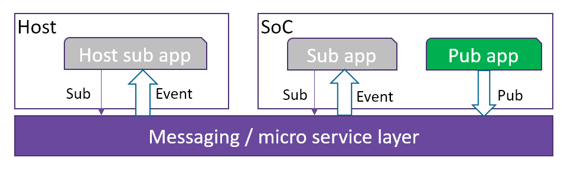
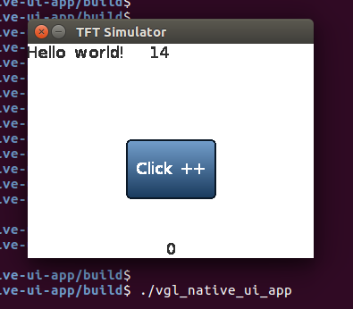

WebAssembly Micro Runtime
=========================
WebAssembly Micro Runtime (WAMR) is a standalone WebAssembly (WASM) runtime designed for a small footprint. It includes:
- A WebAssembly (WASM) VM core
- The supporting API's for the WASM applications
- A mechanism for dynamic management of the WASM application

Why should you use a WASM runtime out of your browser? There are a few points where this might be meaningful:
1.  WASM is already an LLVM official backend target. That means WASM can run any programming languages which can be compiled to LLVM IR. It is a huge advantage compared to language bound runtimes like JS or Lua. 
2.  WASM is an open standard and it is fast becoming supported by the whole web ecosystem.
3.  WASM is designed to be very friendly for compiling to native binaries and gaining the native speed. 
4.  It can potentially change the development practices. Imagine we can do both the WASM application development and validation in a browser, then just download the WASM binary code onto the target device.
5.  WASM can work without garbage collection. It is designed to support execution determinics for the time sensitive requirement.
6.  Maintain the safety goals WASM has of providing a sandboxed execution environment for untrusted code. In addition, because WASM is a compilation target, this implies the benefit of being able to target both an execution and security profile that is consistent across popular high-level programming languages.


Current Features of WAMR
=========================
- WASM interpreter (AOT is planned)
- Provides support for a subset of Libc.
- Supports "SIDE_MODULE=1" EMCC compilation option
- Provides API's for embedding runtime into production software
- Provides a mechanism for exporting native API's to WASM applications
- Supports the programming of firmware apps in a large range of languages (C/C++/Java/Rust/Go/TypeScript etc.)
- App sandbox execution environment on embedded OS
- The purely asynchronized programming model
- Menu configuration for easy platform integration
- Supports micro-service and pub-sub event inter-app communication models
- Easy to extend to support remote FW application management from host or cloud

Architecture
=========================
The application manager component handles the packets that the platform receives from external sources through any communication buses such as a socket, serial port or SPI. A packet type can be either a request, a response or an event. The application manager will serve the requests with URI "/applet" and call the runtime glue layer interfaces for installing/uninstalling the application. For other URI's, it will filter the resource registration table and route the request to the internal queue of the responsible application.

- The WebAssembly runtime provides the execution environment for WASM applications.

- The messaging layer can support the API for WASM applications to communicate with each other and also the host environment.

- When ahead of time (AOT) compilation is enabled (TODO), the WASM application could be either WASM or a compiled native binary.


Build WAMR Core
=========================
Please follow the instructions below to build the WAMR core on different platforms.

Linux
-------------------------
First of all please install library dependencies of lib gcc.
Use installation commands below for Ubuntu Linux:
``` Bash
sudo apt install lib32gcc-5-dev
sudo apt-get install g++-multilib
```
After installing dependencies, build the source code:
``` Bash
cd core/iwasm/products/linux/
mkdir build
cd build
cmake ..
make
```
Zephyr
-------------------------
You need to download the Zephyr source code first and embed WAMR into it.
``` Bash
git clone https://github.com/zephyrproject-rtos/zephyr.git
cd zephyr/samples/
cp -a <iwasm_dir>/products/zephyr/simple .
cd simple
ln -s <iwam_dir> iwasm
ln -s <shared_lib_dir> shared-lib
mkdir build && cd build
source ../../../zephyr-env.sh
cmake -GNinja -DBOARD=qemu_x86 ..
ninja
```

Build WASM app
=========================
A popular method to build a WASM binary is to use ```emcc```.
Assuming you are using Linux, you may install emcc from Emscripten EMSDK following the steps below:
```
git clone https://github.com/emscripten-core/emsdk.git
emsdk install latest
emsdk activate latest
```
source ```./emsdk_env.sh```.
The Emscripten website provides other installation methods beyond Linux.

You can write a simple ```test.c``` as the first sample.
``` C
#include <stdio.h>
#include <stdlib.h>

int main(int argc, char **argv)
{
    char *buf;

    printf("Hello world!\n");

    buf = malloc(1024);
    if (!buf) {
        printf("malloc buf failed\n");
        return -1;
    }

    printf("buf ptr: %p\n", buf);

    sprintf(buf, "%s", "1234\n");
    printf("buf: %s", buf);

    free(buf);
    return 0;
}
```
Use the emcc command below to build the WASM C source code into the WASM binary.
``` Bash
emcc -g -O3 *.c -s WASM=1 -s SIDE_MODULE=1 -s ASSERTIONS=1 -s STACK_OVERFLOW_CHECK=2 \
                -s TOTAL_MEMORY=65536 -s TOTAL_STACK=4096 -o test.wasm
```
You will get ```test.wasm``` which is the WASM app binary.

Run WASM app
========================
Assume you are using Linux, the command to run the test.wasm is:
``` Bash
cd iwasm/products/linux/bin
./iwasm test.wasm
```
You will get the following output:
```
Hello world!
buf ptr: 0x000101ac
buf: 1234
```
If you would like to run the test app on Zephyr, we have embedded a test sample into its OS image. You will need to execute:
```
ninja run
```

Embed WAMR into software production
=====================================
WAMR can be built into a standalone executable which takes the WASM application file name as input, and then executes it. To use it in the embedded environment you should embed WAMR into your own software product. WASM provides a set of API's for embedded code to load the WASM module, instantiate the module and invoke a WASM  function from a native call.


A typical WAMR API usage is shown below (some return value checks are ignored):
``` C
  static char global_heap_buf[512 * 1024];

  char *buffer;
  wasm_module_t module;
  wasm_module_inst_t inst;
  wasm_function_inst_t func;
  wasm_exec_env_t env;
  uint32 argv[2];

  bh_memory_init_with_pool(global_heap_buf, sizeof(global_heap_buf));
  wasm_runtime_init();

  buffer = read_wasm_binary_to_buffer(…);
  module = wasm_runtime_load(buffer, size, err, err_size);
  inst = wasm_runtime_instantiate(module, 0, 0, err, err_size);
  func = wasm_runtime_lookup_function(inst, "fib", "(i32)i32");
  env = wasm_runtime_create_exec_env(stack_size);

  argv[0] = 8;
  if (!wasm_runtime_call_wasm(inst, env, func, 1, argv_buf) ) {
      wasm_runtime_clear_exception(inst);
  }
  /* the return value is stored in argv[0] */
  printf("fib function return: %d\n", argv[0]);

  wasm_runtime_destory_exec_env(env);
  wasm_runtime_deinstantiate(inst);
  wasm_runtime_unload(module);
  wasm_runtime_destroy();
  bh_memory_destroy();
```


WASM application library
========================
In general, there are 3 classes of API's important for the WASM application:
- Built-in API's: WAMR provides a minimal API set for developers.
- 3rd party API's: Programmer can download and include any 3rd party C source code and add it into their own WASM app source tree.
- Platform native API's: WAMR provides a mechanism to export a native API to the WASM application.


Built-in application library
---------------
Built-in API's include Libc API's, Base library and Extension library reference.

**Libc API's**<br/>
This is a minimal set of Libc API's for memory allocation, string manipulation and printing. The header file is located at ```lib/app-libs/libc/lib_base.h```. The current supported API set is listed here:
``` C
void *malloc(size_t size);
void *calloc(size_t n, size_t size);
void free(void *ptr);
int memcmp(const void *s1, const void *s2, size_t n);
void *memcpy(void *dest, const void *src, size_t n);
void *memmove(void *dest, const void *src, size_t n);
void *memset(void *s, int c, size_t n);
int putchar(int c);
int snprintf(char *str, size_t size, const char *format, ...);
int sprintf(char *str, const char *format, ...);
char *strchr(const char *s, int c);
int strcmp(const char *s1, const char *s2);
char *strcpy(char *dest, const char *src);
size_t strlen(const char *s);
int strncmp(const char * str1, const char * str2, size_t n);
char *strncpy(char *dest, const char *src, unsigned long n);
```

**Base library**<br/>
Basic support for communication, timers, etc is available. You can refer to the header file ```lib/app-libs/base/wasm_app.h``` which contains the definitions for request and response API's, event pub/sub API's and timer API's. Please note that these API's require the native implementations.
The API set is listed below:
``` C
typedef void(*request_handler_f)(request_t *) ;
typedef void(*response_handler_f)(response_t *, void *) ;

// Request API's
bool api_register_resource_handler(const char *url, request_handler_f);
void api_send_request(request_t * request, response_handler_f response_handler, void * user_data);
void api_response_send(response_t *response);

// Event API's
bool api_publish_event(const char *url,  int fmt, void *payload,  int payload_len);
bool api_subscribe_event(const char * url, request_handler_f handler);

struct user_timer;
typedef struct user_timer * user_timer_t;

// Timer API's
user_timer_t api_timer_create(int interval, bool is_period, bool auto_start, void(*on_user_timer_update)(user_timer_t
));
void api_timer_cancel(user_timer_t timer);
void api_timer_restart(user_timer_t timer, int interval);
```

**Library extension reference**<br/>
Currently we provide the sensor API's as one library extension sample. In the header file ```lib/app-libs/extension/sensor/sensor.h```, the API set is defined as below:
``` C
sensor_t sensor_open(const char* name, int index,
                                     void(*on_sensor_event)(sensor_t, attr_container_t *, void *),
                                     void *user_data);
bool sensor_config(sensor_t sensor, int interval, int bit_cfg, int delay);
bool sensor_config_with_attr_container(sensor_t sensor, attr_container_t *cfg);
bool sensor_close(sensor_t sensor);
```

The mechanism of exporting native API to WASM application
=======================================================

The basic working flow for WASM application calling into the native API is shown in the following diagram:


WAMR provides the macro `EXPORT_WASM_API` to enable users to export a native API to a WASM application. WAMR has implemented a base API for the timer and messaging by using `EXPORT_WASM_API`. This can be a point of reference for extending your own library.
``` C
static NativeSymbol extended_native_symbol_defs[] = {
    EXPORT_WASM_API(wasm_register_resource),
    EXPORT_WASM_API(wasm_response_send),
    EXPORT_WASM_API(wasm_post_request),
    EXPORT_WASM_API(wasm_sub_event),
    EXPORT_WASM_API(wasm_create_timer),
    EXPORT_WASM_API(wasm_timer_set_interval),
    EXPORT_WASM_API(wasm_timer_cancel),
    EXPORT_WASM_API(wasm_timer_restart)
};
```

 **Security attention:** A WebAssembly application should only have access to its own memory space. As a result, the integrator should carefully design the native function to ensure that the memory accesses are safe. The native API to be exported to the WASM application must:
- Only use 32 bits number for parameters
- Should not pass data to the structure pointer (do data serialization instead)
- Should do the pointer address conversion in the native API
- Should not pass function pointer as callback

Below is a sample of a library extension. All code invoked across WASM and native world must be serialized and de-serialized, and the native world must do a boundary check for every incoming address from the WASM world.


Steps for exporting native API
==========================

WAMR implemented a framework for developers to export API's. Below is the procedure to expose the platform API's in three steps:

**Step 1. Create a header file**<br/>
Declare the API's for your WASM application source project to include.

**Step 2. Create a source file**<br/>
Export the platform API's, for example in ``` products/linux/ext_lib_export.c ```
``` C
#include "lib_export.h"

static NativeSymbol extended_native_symbol_defs[] =
{
};

#include "ext_lib_export.h"
```

**Step 3. Register new API's**<br/>
Use the macro `EXPORT_WASM_API` and `EXPORT_WASM_API2` to add exported API's into the array of ```extended_native_symbol_defs```.
The pre-defined MACRO `EXPORT_WASM_API` should be used to declare a function export:
``` c
#define EXPORT_WASM_API(symbol)  {#symbol, symbol}
```

Below code example shows how to extend the library to support `customized()`:

``` 
//lib_export_impl.c
void customized()
{
   // your code
}


// lib_export_dec.h
#ifndef _LIB_EXPORT_DEC_H_
#define _LIB_EXPORT_DEC_H_
#ifdef __cplusplus
extern "C" {
#endif

void customized();

#ifdef __cplusplus
}
#endif
#endif


// ext_lib_export.c
#include "lib_export.h"
#include "lib_export_dec.h"

static NativeSymbol extended_native_symbol_defs[] =
{
    EXPORT_WASM_API(customized)
};

#include "ext_lib_export.h"
```

Use extended library
------------------------
In the application source project, it will include the WAMR built-in API's header file and platform extension header files. Assuming the board vendor extends the library which added an API called customized(), the WASM application would be like this:
``` C
#include <stdio.h>
#include "lib_export_dec.h" // provided by the platform vendor

int main(int argc, char **argv)
{
    int I;
    char *buf = “abcd”;
    customized();                   // customized API provided by the platform vendor
    return i;
}
```


Communication programming models
=========================
WAMR supports two typical communication programming models, the microservice model and the pub/sub model. 


Microservice model
-------------------------
The microservice model is also known as request and response model. One WASM application acts as the server which provides a specific service. Other WASM applications or host/cloud applications request that service and get the response.


Below is the reference implementation of the server application. It provides room temperature measurement service.

``` C
void on_init()
{
    api_register_resource_handler("/room_temp", room_temp_handler);
}

void on_destroy() 
{
}

void room_temp_handler(request_t *request)
{
    response_t response[1];
    attr_container_t *payload;
    payload = attr_container_create("room_temp payload");
    if (payload == NULL)
        return;

    attr_container_set_string(&payload, "temp unit", "centigrade");
    attr_container_set_int(&payload, "value", 26);

    make_response_for_request(request, response);
    set_response(response,
                 CONTENT_2_05,
                 FMT_ATTR_CONTAINER,
                 payload,
                 attr_container_get_serialize_length(payload));

    api_response_send(response);
    attr_container_destroy(payload);
}
```


Pub/sub model
-------------------------
One WASM application acts as the event publisher. It publishes events to notify WASM applications or host/cloud applications which subscribe to the events.



Below is the reference implementation of the pub application. It utilizes a timer to repeatedly publish an overheat alert event to the subscriber applications. Then the subscriber applications receive the events immediately.

``` C
/* Timer callback */
void timer_update(user_timer_t timer
{
    attr_container_t *event;

    event = attr_container_create("event");
    attr_container_set_string(&event,
                              "warning",
                              "temperature is over high");

    api_publish_event("alert/overheat",
                      FMT_ATTR_CONTAINER,
                      event,
                      attr_container_get_serialize_length(event));

    attr_container_destroy(event);
}

void on_init()
{
    user_timer_t timer;
    timer = api_timer_create(1000, true, true, timer_update);
}

void on_destroy()
{
}
```

Below is the reference implementation of the sub application.
``` C
void overheat_handler(request_t *event)
{
    printf("Event: %s\n", event->url);

    if (event->payload != NULL && event->fmt == FMT_ATTR_CONTAINER)
       attr_container_dump((attr_container_t *) event->payload);
}

void on_init(
{
    api_subscribe_event ("alert/overheat", overheat_handler);
}

void on_destroy()
{
}
```
**Note:** You can also subscribe this event from host side by using host tool. Please refer `samples/simple` project for deail usage.

Samples and demos
=========================
The simple sample
--------
Please refer to the ```samples/simple``` folder for samples of WASM application life cyle management and programming models.

2D graphic user interface with LittlevGL
------------------------------------------------
This sample demonstrates that a graphic user interface application in WebAssembly  integrates  the LittlevGL, an open-source embedded 2d graphic library. The sample source code is under ```samples/littlevgl``` 

In this sample, the LittlevGL source code is built into the WebAssembly code with the user application source files. The platform interfaces defined by LittlevGL is implemented in the runtime and exported to the application through the declarations from source "ext_lib_export.c" as below:

        EXPORT_WASM_API(display_init),
        EXPORT_WASM_API(display_input_read),
        EXPORT_WASM_API(display_flush),
        EXPORT_WASM_API(display_fill),
        EXPORT_WASM_API(display_vdb_write),
        EXPORT_WASM_API(display_map),
        EXPORT_WASM_API(time_get_ms), };

The runtime component supports building target for Linux and Zephyr/STM Nucleo board respectively. The beauty of this sample is the WebAssembly application can have identical display and behavior when running from both runtime environments. That implies we can do the majority of application validation from the desktop environment then load it to the target device as long as two runtime distributions support the same set of the application interface.


Below pictures show the WASM application is running on an STM board with an LCD touch panel. When users click the blue button, the WASM application increases the counter, and the latest counter value is displayed on the top banner of the touch panel. 


The sample also provides the native Linux version of application without the runtime under folder "vgl-native-ui-app". It can help to check differences between the implementations in native and WebAssembly.



Submit issues and contact the maintainers
=========================================
[Click here to submit. Your feedback is always welcome!](https://github.com/intel/wasm-micro-runtime/issues/new)


Contact the maintainers: imrt-public@intel.com
