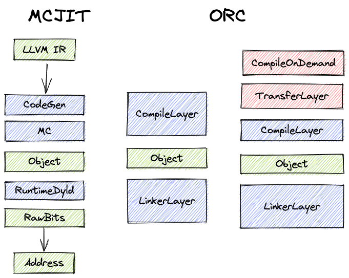

# Apply LLVM ORCv2 into WAMR

On-Request-Compilation (ORC) is LLVM's next generation of JIT API. It is used to
replace the previous MC JIT.

In history, there are three JIT implementations in LLVM:

- Legacy JIT. From LLVM 1.0 to LLVM 3.5.
- MCJIT. From LLVM 2.9 to now.
- ORCJIT. From LLVM 3.7 to now.

ORC could be considered as a _modularizing_ MCJIT. ORC reorgnized MCJIT pipelines
into _compile layer_ and _link layer_. Plus, used _memory manger_ to handle memory
ownership, _symbol resolves_ to handle symbol resolution.

## Concepts

### ThreadSafeModule and ThreadSafeContext
_TODO_

### Compile-On-Demand (COD) Layer

_Compile-on-demand_ (COD) is a new layer above the _compile layer_ to provide lazy
compilation feature. COD contains

- _indirect stubs manager_. Creates named indirect stubs and modifies stubs after
  lazy compilation.
- _compile callback manager_ Provide re-entry points in the compiler.

Each stub can be treaded as a `jmp $ptr`. If the target function has not been
compiled, `$ptr` points to the compilerlayer entry and triggeres the lazy compilation.
After compilation, `$ptr` will be changed and points to the jitted implementation.

### Transform Layer

_Transform Layer_ is another new layer for optimization.

### ObjLinkingLayer

### LLJIT and LLLazyJIT

`LLJIT` and `LLLazyJIT` are two high-level interfaces of ORC. With those, we can
avoidi operating lower APIs like Kaleidoscope.

The `LLJIT` class uses an `IRCompileLayer` and `RTDyldObjectLinkingLayer` to
support compilation of LLVM IR and linking of relocatable object files. All
operations are performed eagerly on symbol `lookup`.

The `LLLazyJIT` extends `LLJIT` and adds a `CompileOnDemandLayer` to enable lazy
compilation of LLVM IR. When an LLVM IR module is added via the `addLazyIRModule`
method, function bodies in that module will not be compiled until they are first
called.

## Compilation Options

### JIT modes

For now, there will be three different JIT modes in WAMR.

- MCJIT. Keep it in maintaince. Will remove it in the future. It doesn't support
  lazy compilation.
- ORC with lazy compilation. It is the default JIT mode.
- ORC with eagel compilation. It is used when generating AOT files.

Use `WAMR_BUILD_MCJIT` and `WAMR_BUILD_LAZY_JIT` to control all three above.

- `-DWAMR_BUILD_JIT=1` goes to ORC with lazy compilation.
- `-DWAMR_BUILD_JIT=1 -DWAMR_BUILD_LAZY_JIT=0` goes to ORC with eagel compilation.
- `-DWAMR_BUILD_JIT=1 -DWAMR_BUILD_MCJIT=1` goes to MCJIT.

### PassManager

_TODO_

## How to

### How to setup ORC

Both _JIT_ mode and _AOT_ mode follow the same path to create `LLVMOrcJITRef`.

1. create `LLVMOrcLLJITBuilderRef`
2. create `LLVMOrcJITTargetMachineBuilderRef`
3. `LLVMOrcLLJITBuilderSetJITTargetMachineBuilder(...)` with `LLVMOrcJITTargetMachineBuilderRef`
4. create `LLVMOrcJITRef` with `LLVMOrcLLJITBuilderRef`

The only difference is: _JIT_ creates `LLVMOrcJITTargetMachineBuilderRef` with
detectted host information but _AOT_ creates with user specified `LLVMTargetMachineRef`.

### How to do compilation

### How to optimize
