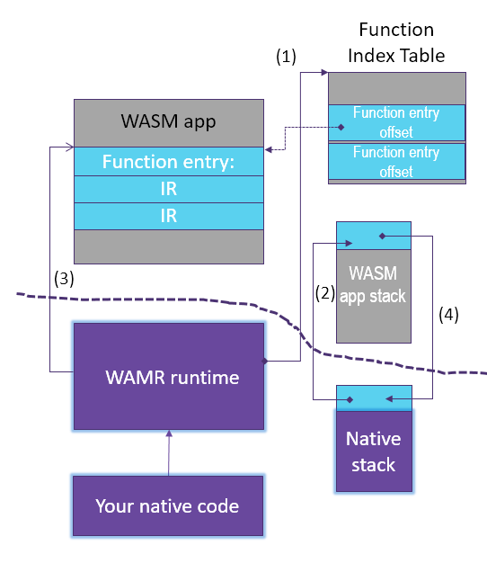

Embed WAMR into software production
=====================================




A typical WAMR API usage is shown below (some return value checks are ignored):
``` C
  static char global_heap_buf[512 * 1024];

  char *buffer, error_buf[128];
  wasm_module_t module;
  wasm_module_inst_t module_inst;
  wasm_function_inst_t func;
  wasm_exec_env_t exec_env;
  uint32 argv[2], size, stack_size = 8092, heap_size = 8092;

  bh_memory_init_with_pool(global_heap_buf, sizeof(global_heap_buf));
  wasm_runtime_init();

  buffer = read_wasm_binary_to_buffer(…, &size);
  module = wasm_runtime_load(buffer, size, error_buf, sizeof(error_buf));
  module_inst = wasm_runtime_instantiate(module, stack_size, heap_size,
                                         error_buf, sizeof(error_buf));
  func = wasm_runtime_lookup_function(module_inst, "fib", "(i32)i32");
  exec_env = wasm_runtime_create_exec_env(module_inst, stack_size);

  argv[0] = 8;
  if (wasm_runtime_call_wasm(exec_env, func, 1, argv_buf) ) {
    /* the return value is stored in argv[0] */
    printf("fib function return: %d\n", argv[0]);
  }
  else {
    printf("%s\n", wasm_runtime_get_exception(module_inst));
  }

  wasm_runtime_destroy_exec_env(exec_env);
  wasm_runtime_deinstantiate(module_inst);
  wasm_runtime_unload(module);
  wasm_runtime_destroy();
  bh_memory_destroy();
```

