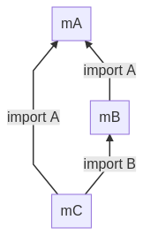

Multiple Modules as Dependencies
=========================

It is allowed that one WASM module can *import* *functions*, *globals*, *memories* and *tables* from other modules as its dependencies, and also one module can *export* those entities for other modules to *access* and may *write*.

WAMR loads all dependencies recursively according to the *import section* of a module.

> Currently WAMR only implements the load-time dynamic linking. Please refer to [dynamic linking](https://webassembly.org/docs/dynamic-linking/) for more details.

## Multi-Module Related APIs

### Register a module

``` c
bool
wasm_runtime_register_module(const char *module_name,
                             wasm_module_t module,
                             char *error_buf,
                             uint32_t error_buf_size);
```

It is used to register a *module* with a *module_name* to WASM runtime, especially for the root module, which is loaded by `wasm_runtime_load()` and doesn't have a chance to tell runtime its *module name*.

Fot all the sub modules, WAMR will get their names and load the .wasm files from the filesystem or stream, so no need to register the sub modules again.

### Find a registered module

``` c
wasm_module_t
wasm_runtime_find_module_registered(
    const char *module_name);
```

It is used to check if a module with a given *module_name* has been registered, if yes return the module.

### Module reader and destroyer

``` c
typedef bool (*module_reader)(const char *module_name,
                              uint8_t **p_buffer,
                              uint32_t *p_size);

typedef void (*module_destroyer)(uint8_t *buffer,
                                 uint32_t size);

void
wasm_runtime_set_module_reader(const module_reader reader,
                               const module_destroyer destroyer);
```

WAMR hopes that the native host or embedding environment loads/unloads the module WASM files by themselves and only passes runtime the binary content without worrying filesystem or storage issues. `module_reader` and `module_destroyer` are two callbacks called when dynamic-loading/unloading the sub modules. Developers must implement the two callbacks by themselves.

### Call function of sub module

```c
wasm_function_inst_t
wasm_runtime_lookup_function(wasm_module_inst_t const module_inst,
                             const char *name,
                             const char *signature);
```

Multi-module allows to lookup the function of sub module and call it. There are two ways to indicate the function *name*:

- parent function name only by default, used to lookup the function of parent module
- sub module name, function name of sub module and two $ symbols, e.g. `$sub_module_name$function_name`, used to lookup function of sub module

## Example

### WASM modules
Suppose we have three C files, *mA.c*, *mB.c* and *mC.c*. Each of them has some exported functions and import some from others except mA.

Undefined symbols can be marked in the source code with the *import_name* clang attribute which means that they are expected to be undefined at static link time. Without the *import_module* clang attribute, undefined symbols will be marked from the *env* module.

``` C
// mA.c
int A() { return 10; }
```

``` C
// mB.c
__attribute__((import_module("mA"))) __attribute__((import_name("A"))) extern int A();
int B() { return 11; }
int call_A() { return A(); }
```

``` C
// mC.c
__attribute__((import_module("mA"))) __attribute__((import_name("A"))) extern int A();
__attribute__((import_module("mB"))) __attribute__((import_name("B"))) extern int B();
int C() { return 12; }
int call_A() { return A(); }
int call_B() { return B(); }
```

By default no undefined symbols are allowed in the final binary. The flag *--allow-undefined* results in a WebAssembly import being defined for each undefined symbol. It is then up to the runtime to provide such symbols.

When building an executable, only the entry point (_start) and symbols with the *export_name* attribute  exported by default. in addition, symbols can be exported via the linker command line using *--export*.

In the example, another linked command option *--export-all* is used.

> with more detail, please refer to [WebAssembly lld port][https://lld.llvm.org/WebAssembly.html]

Here is an example how to compile a *.c* to a *.wasm* with clang. Since there is no *start* function, we use *--no-entry* option.

``` shell
$ clang --target=wasm32 -nostdlib \
    -Wl,--no-entry,--allow-undefined,--export-all \
    -o mA.wasm mA.c
$ clang --target=wasm32 -nostdlib \
    -Wl,--no-entry,--allow-undefined,--export-all \
    -o mB.wasm mB.c
$ clang --target=wasm32 -nostdlib \
    -Wl,--no-entry,--allow-undefined,--export-all \
    -o mC.wasm mC.c
```

put *mA.wasm*, *mB.wasm* and *mC.wasm* in the directory *wasm-apps*

``` shell
$ # copy mA.wasm, mB.wasm and mC.wasm into wasm-apps
$ tree wasm-apps/
wasm-apps/
├── mA.wasm
├── mB.wasm
└── mC.wasm
```

eventually, their *import relationships* will be like:



### libvmlib

We need to enable *WAMR_BUILD_MULTI_MODULE* option when building WAMR vmlib. Please ref to [Build WAMR core](./build_wamr.md) for a thoughtful guide.

### code

After all above preparation, we can call some functions from native code with APIs

first, create two callbacks to load WASM module files into memory and unload them later

``` c
static bool
module_reader_cb(const char *module_name, uint8 **p_buffer, uint32 *p_size)
{
  // ...
  *p_buffer = (uint8_t *)bh_read_file_to_buffer(wasm_file_path, p_size);
  // ...
}

static void
module_destroyer_cb(uint8 *buffer, uint32 size)
{
  BH_FREE(buffer);
}
```

second, create a large buffer and tell WAMR malloc any resource only from this buffer later

``` c
static char sandbox_memory_space[10 * 1024 * 1024] = { 0 };
```

third, put all together

``` c
int main()
{
  /* all malloc() only from the given buffer */
  init_args.mem_alloc_type = Alloc_With_Pool;
  init_args.mem_alloc_option.pool.heap_buf = sandbox_memory_space;
  init_args.mem_alloc_option.pool.heap_size = sizeof(sandbox_memory_space);

  /* initialize runtime environment */
  wasm_runtime_full_init(&init_args);

  /* set module reader and destroyer */
  wasm_runtime_set_module_reader(module_reader_cb, module_destroyer_cb);

  /* load WASM byte buffer from WASM bin file */
  module_reader_cb("mC", &file_buf, &file_buf_size));

  /* load mC and let WAMR load mA and mB */
  module = wasm_runtime_load(file_buf, file_buf_size,
                             error_buf, sizeof(error_buf));

  /* instantiate the module */
  module_inst =
          wasm_runtime_instantiate(module, stack_size,
          heap_size, error_buf, sizeof(error_buf)));


  printf("call \"C\", it will return 0xc:i32, ===> ");
  wasm_application_execute_func(module_inst, "C", 0, &args[0]);
  printf("call \"call_B\", it will return 0xb:i32, ===> ");
  wasm_application_execute_func(module_inst, "call_B", 0, &args[0]);
  printf("call \"call_A\", it will return 0xa:i32, ===>");
  wasm_application_execute_func(module_inst, "call_A", 0, &args[0]);

  /* call some functions of mB */
  printf("call \"mB.B\", it will return 0xb:i32, ===>");
  wasm_application_execute_func(module_inst, "$mB$B", 0, &args[0]);
  printf("call \"mB.call_A\", it will return 0xa:i32, ===>");
  wasm_application_execute_func(module_inst, "$mB$call_A", 0, &args[0]);

  /* call some functions of mA */
  printf("call \"mA.A\", it will return 0xa:i32, ===>");
  wasm_application_execute_func(module_inst, "$mA$A", 0, &args[0]);

  // ...
}
```

> please refer to [main.c](../samples/multi_modules/src/main.c)

The output of the main.c will like:

``` shell
$ ./a.out

call "C", it will return 0xc:i32, ===> 0xc:i32
call "call_B", it will return 0xb:i32, ===> 0xb:i32
call "call_A", it will return 0xa:i32, ===>0xa:i32
call "mB.B", it will return 0xb:i32, ===>0xb:i32
call "mB.call_A", it will return 0xa:i32, ===>0xa:i32
call "mA.A", it will return 0xa:i32, ===>0xa:i32

```
