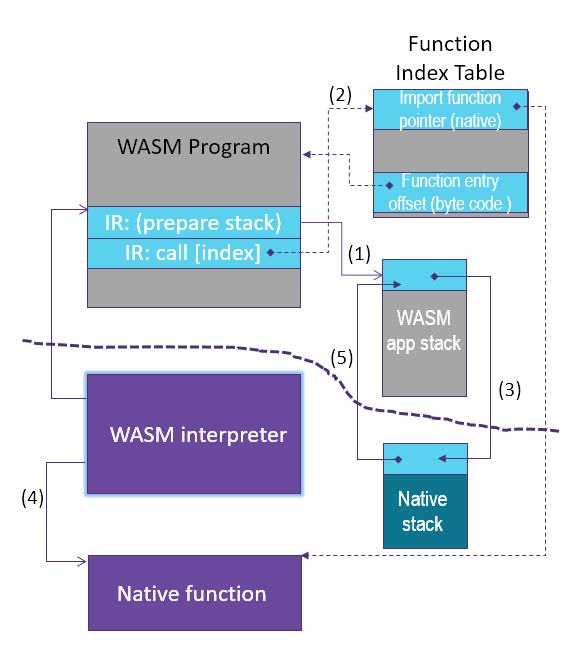
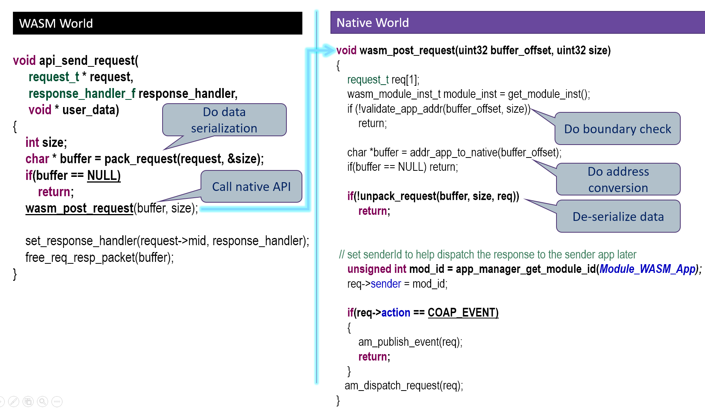

WASM application library
========================
In general, there are 3 classes of API's important for the WASM application:
- Built-in API's: WAMR provides a minimal API set for developers.
- 3rd party API's: Programmer can download and include any 3rd party C source code and add it into their own WASM app source tree.
- Platform native API's: WAMR provides a mechanism to export a native API to the WASM application.


Built-in application library
---------------
Built-in API's include Libc API's, Base library and Extension library reference.

**Libc API's**<br/>
This is a minimal set of Libc API's for memory allocation, string manipulation and printing. The header file is located at ```lib/app-libs/libc/lib_base.h```. The current supported API set is listed here:
``` C
void *malloc(size_t size);
void *calloc(size_t n, size_t size);
void free(void *ptr);
int memcmp(const void *s1, const void *s2, size_t n);
void *memcpy(void *dest, const void *src, size_t n);
void *memmove(void *dest, const void *src, size_t n);
void *memset(void *s, int c, size_t n);
int putchar(int c);
int snprintf(char *str, size_t size, const char *format, ...);
int sprintf(char *str, const char *format, ...);
char *strchr(const char *s, int c);
int strcmp(const char *s1, const char *s2);
char *strcpy(char *dest, const char *src);
size_t strlen(const char *s);
int strncmp(const char * str1, const char * str2, size_t n);
char *strncpy(char *dest, const char *src, unsigned long n);
```

**Base library**<br/>
Basic support for communication, timers, etc is available. You can refer to the header file ```lib/app-libs/base/wasm_app.h``` which contains the definitions for request and response API's, event pub/sub API's and timer API's. Please note that these API's require the native implementations.
The API set is listed below:
``` C
typedef void(*request_handler_f)(request_t *) ;
typedef void(*response_handler_f)(response_t *, void *) ;

// Request API's
bool api_register_resource_handler(const char *url, request_handler_f);
void api_send_request(request_t * request, response_handler_f response_handler, void * user_data);
void api_response_send(response_t *response);

// Event API's
bool api_publish_event(const char *url,  int fmt, void *payload,  int payload_len);
bool api_subscribe_event(const char * url, request_handler_f handler);

struct user_timer;
typedef struct user_timer * user_timer_t;

// Timer API's
user_timer_t api_timer_create(int interval, bool is_period, bool auto_start, void(*on_user_timer_update)(user_timer_t
));
void api_timer_cancel(user_timer_t timer);
void api_timer_restart(user_timer_t timer, int interval);
```

**Library extension reference**<br/>
Currently we provide several kinds of extension library for reference including sensor, connection and GUI.

Sensor API: In the header file ```lib/app-libs/extension/sensor/sensor.h```, the API set is defined as below:
``` C
sensor_t sensor_open(const char* name, int index,
                     void(*on_sensor_event)(sensor_t, attr_container_t *, void *),
                     void *user_data);
bool sensor_config(sensor_t sensor, int interval, int bit_cfg, int delay);
bool sensor_config_with_attr_container(sensor_t sensor, attr_container_t *cfg);
bool sensor_close(sensor_t sensor);
```
Connection API: In the header file `lib/app-libs/extension/connection/connection.h.`, the API set is defined as below:
``` C
/* Connection event type */
typedef enum {
    /* Data is received */
    CONN_EVENT_TYPE_DATA = 1,
    /* Connection is disconnected */
    CONN_EVENT_TYPE_DISCONNECT
} conn_event_type_t;

typedef void (*on_connection_event_f)(connection_t *conn,
                                      conn_event_type_t type,
                                      const char *data,
                                      uint32 len,
                                      void *user_data);
connection_t *api_open_connection(const char *name,
                                  attr_container_t *args,
                                  on_connection_event_f on_event,
                                  void *user_data);
void api_close_connection(connection_t *conn);
int api_send_on_connection(connection_t *conn, const char *data, uint32 len);
bool api_config_connection(connection_t *conn, attr_container_t *cfg);
```
GUI API: The API's is list in header file ```lib/app-libs/extension/gui/wgl.h``` which is implemented based open soure 2D graphic library [LittlevGL](https://docs.littlevgl.com/en/html/index.html). Currently supported widgets include button, label, list and check box and more wigdet would be provided in future.

The mechanism of exporting native API to WASM application
=======================================================

The basic working flow for WASM application calling into the native API is shown in the following diagram:




WAMR provides the macro `EXPORT_WASM_API` to enable users to export a native API to a WASM application. WAMR has implemented a base API for the timer and messaging by using `EXPORT_WASM_API`. This can be a point of reference for extending your own library.
``` C
static NativeSymbol extended_native_symbol_defs[] = {
    EXPORT_WASM_API(wasm_register_resource),
    EXPORT_WASM_API(wasm_response_send),
    EXPORT_WASM_API(wasm_post_request),
    EXPORT_WASM_API(wasm_sub_event),
    EXPORT_WASM_API(wasm_create_timer),
    EXPORT_WASM_API(wasm_timer_set_interval),
    EXPORT_WASM_API(wasm_timer_cancel),
    EXPORT_WASM_API(wasm_timer_restart)
};
```

 **Security attention:** A WebAssembly application should only have access to its own memory space. As a result, the integrator should carefully design the native function to ensure that the memory accesses are safe. The native API to be exported to the WASM application must:
- Only use 32 bits number for parameters
- Should not pass data to the structure pointer (do data serialization instead)
- Should do the pointer address conversion in the native API
- Should not pass function pointer as callback

Below is a sample of a library extension. All code invoked across WASM and native world must be serialized and de-serialized, and the native world must do a boundary check for every incoming address from the WASM world.





Steps for exporting native API
==========================

WAMR implemented a framework for developers to export API's. Below is the procedure to expose the platform API's in three steps:

**Step 1. Create a header file**<br/>
Declare the API's for your WASM application source project to include.

**Step 2. Create a source file**<br/>
Export the platform API's, for example in ``` products/linux/ext_lib_export.c ```
``` C
#include "lib_export.h"

static NativeSymbol extended_native_symbol_defs[] =
{
};

#include "ext_lib_export.h"
```

**Step 3. Register new API's**<br/>
Use the macro `EXPORT_WASM_API` and `EXPORT_WASM_API2` to add exported API's into the array of ```extended_native_symbol_defs```.
The pre-defined MACRO `EXPORT_WASM_API` should be used to declare a function export:
``` c
#define EXPORT_WASM_API(symbol)  {#symbol, symbol}
```

Below code example shows how to extend the library to support `customized()`:

``` 
//lib_export_impl.c
void customized()
{
   // your code
}


// lib_export_dec.h
#ifndef _LIB_EXPORT_DEC_H_
#define _LIB_EXPORT_DEC_H_
#ifdef __cplusplus
extern "C" {
#endif

void customized();

#ifdef __cplusplus
}
#endif
#endif


// ext_lib_export.c
#include "lib_export.h"
#include "lib_export_dec.h"

static NativeSymbol extended_native_symbol_defs[] =
{
    EXPORT_WASM_API(customized)
};

#include "ext_lib_export.h"
```

Use extended library
------------------------
In the application source project, it will include the WAMR built-in API's header file and platform extension header files. Assuming the board vendor extends the library which added an API called customized(), the WASM application would be like this:
``` C
#include <stdio.h>
#include "lib_export_dec.h" // provided by the platform vendor

int main(int argc, char **argv)
{
    int I;
    char *buf = “abcd”;
    customized();                   // customized API provided by the platform vendor
    return i;
}
```


Communication programming models
=========================
WAMR supports two typical communication programming models, the microservice model and the pub/sub model. 


Microservice model
-------------------------
The microservice model is also known as request and response model. One WASM application acts as the server which provides a specific service. Other WASM applications or host/cloud applications request that service and get the response.


Below is the reference implementation of the server application. It provides room temperature measurement service.

``` C
void on_init()
{
    api_register_resource_handler("/room_temp", room_temp_handler);
}

void on_destroy() 
{
}

void room_temp_handler(request_t *request)
{
    response_t response[1];
    attr_container_t *payload;
    payload = attr_container_create("room_temp payload");
    if (payload == NULL)
        return;

    attr_container_set_string(&payload, "temp unit", "centigrade");
    attr_container_set_int(&payload, "value", 26);

    make_response_for_request(request, response);
    set_response(response,
                 CONTENT_2_05,
                 FMT_ATTR_CONTAINER,
                 payload,
                 attr_container_get_serialize_length(payload));

    api_response_send(response);
    attr_container_destroy(payload);
}
```


Pub/sub model
-------------------------
One WASM application acts as the event publisher. It publishes events to notify WASM applications or host/cloud applications which subscribe to the events.


Below is the reference implementation of the pub application. It utilizes a timer to repeatedly publish an overheat alert event to the subscriber applications. Then the subscriber applications receive the events immediately.

``` C
/* Timer callback */
void timer_update(user_timer_t timer
{
    attr_container_t *event;

    event = attr_container_create("event");
    attr_container_set_string(&event,
                              "warning",
                              "temperature is over high");

    api_publish_event("alert/overheat",
                      FMT_ATTR_CONTAINER,
                      event,
                      attr_container_get_serialize_length(event));

    attr_container_destroy(event);
}

void on_init()
{
    user_timer_t timer;
    timer = api_timer_create(1000, true, true, timer_update);
}

void on_destroy()
{
}
```

Below is the reference implementation of the sub application.
``` C
void overheat_handler(request_t *event)
{
    printf("Event: %s\n", event->url);

    if (event->payload != NULL && event->fmt == FMT_ATTR_CONTAINER)
       attr_container_dump((attr_container_t *) event->payload);
}

void on_init(
{
    api_subscribe_event ("alert/overheat", overheat_handler);
}

void on_destroy()
{
}
```
**Note:** You can also subscribe this event from host side by using host tool. Please refer `samples/simple` project for deail usage.