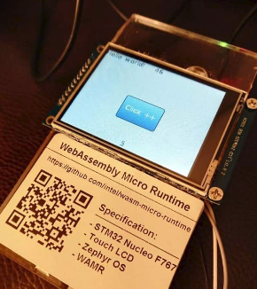

"gui" sample introduction
==============
This sample demonstrates that a graphic user interface application in WebAssembly programming with WAMR graphic library(WGL)  which is part of WAMR app-framework. 

Compared with the [littlevgl](../littlevgl) sample, WGL compiles LittlevGL source code into the WAMR runtime and defines a set of wrapper API's for exporting to Webassembly application.


Below picture shows the WASM application is running on an STM board with an LCD touch panel.




 When users click the blue button, the WASM application increases the counter, and the latest counter value is displayed on the top banner of the touch panel. The number on top will plus one each second, and the number on the bottom will plus one when clicked.

# Test on Linux

Install required SDK and libraries
--------------
- 32 bit SDL(simple directmedia layer) (Note: only necessary when `WAMR_BUILD_TARGET` is set to `X86_32` when building WAMR runtime)
Use apt-get:
    `sudo apt-get install libsdl2-dev:i386`
Or download source from www.libsdl.org:
```
./configure C_FLAGS=-m32 CXX_FLAGS=-m32 LD_FLAGS=-m32
make
sudo make install
```
- 64 bit SDL(simple directmedia layer) (Note: only necessary when `WAMR_BUILD_TARGET` is set to `X86_64` when building WAMR runtime)
Use apt-get:
    `sudo apt-get install libsdl2-dev`
Or download source from www.libsdl.org:
```
./configure
make
sudo make install
```

Build and Run
--------------

- Build</br>
`./build.sh`</br>
    All binaries are in "out", which contains "host_tool", "ui_decrease.wasm", "ui_increase.wasm" and "wasm_runtime_wgl".

- Run WASM VM Linux applicaton & install WASM APP</br>
 First start wasm_runtime_wgl in server mode.</br>
`./wasm_runtime_wgl -s`</br>
 Then install wasm APP use host tool.</br>
`./host_tool -i inc -f ui_increase.wasm`</br>
`./host_tool -i dec -f ui_decrease.wasm`</br>


Test on Zephyr
================================

We can use a STM32 NUCLEO_F767ZI  board with ILI9341 display and XPT2046 touch screen to run the test. Then use host_tool to remotely install wasm app into STM32.
- Build WASM VM into Zephyr system</br>
 a. clone zephyr source code</br>
Refer to Zephyr getting started.</br>
https://docs.zephyrproject.org/latest/getting_started/index.html</br>
`west init zephyrproject`</br>
`cd zephyrproject`</br>
`west update`</br>
 b. copy samples</br>
    `cd zephyr/samples/`</br>
    `cp -a <wamr_root>samples/gui/wasm-runtime-wgl wasm-runtime-wgl`</br>
    `cd wasm-runtime-wgl/zephyr_build`</br>
 c. create a link to wamr root dir</br>
   ` ln -s <wamr_root> wamr`</br>
 d. build source code</br>
    `mkdir build && cd build`</br>
    `source ../../../../zephyr-env.sh`</br>
    `cmake -GNinja -DBOARD=nucleo_f767zi ..`</br>
   ` ninja flash`</br>

- Hardware Connections

```
+-------------------+-+------------------+
|NUCLEO-F767ZI       | ILI9341  Display  |
+-------------------+-+------------------+
| CN7.10             |         CLK       |
+-------------------+-+------------------+
| CN7.12             |         MISO      |
+-------------------+-+------------------+
| CN7.14             |         MOSI      |
+-------------------+-+------------------+
| CN11.1             | CS1 for ILI9341   |
+-------------------+-+------------------+
| CN11.2             |         D/C       |
+-------------------+-+------------------+
| CN11.3             |         RESET     |
+-------------------+-+------------------+
| CN9.25             |    PEN interrupt  |
+-------------------+-+------------------+
| CN9.27             |  CS2 for XPT2046  |
+-------------------+-+------------------+
| CN10.14            |    PC UART RX     |
+-------------------+-+------------------+
| CN11.16            |    PC UART RX     |
+-------------------+-+------------------+
```


- Install WASM application to Zephyr using host_tool</br>
First, connect PC and STM32 with UART. Then install to use host_tool.</br>
`./host_tool -D /dev/ttyUSBXXX -i inc -f ui_increase.wasm`

- Install AOT version WASM application
`wamrc --target=thumbv7 --target-abi=eabi --cpu=cortex-m7 -o ui_app.aot ui_increase.wasm`
`./host_tool -D /dev/ttyUSBXXX -i inc -f ui_app.aot`


The graphic user interface demo photo:


