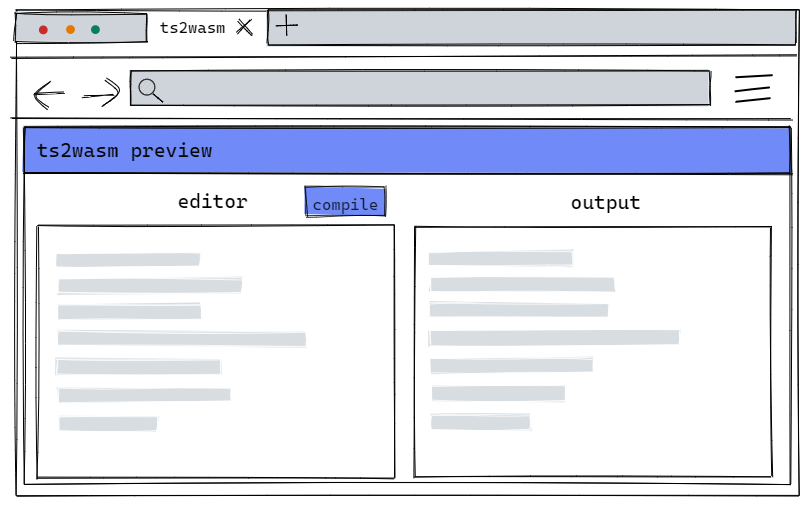
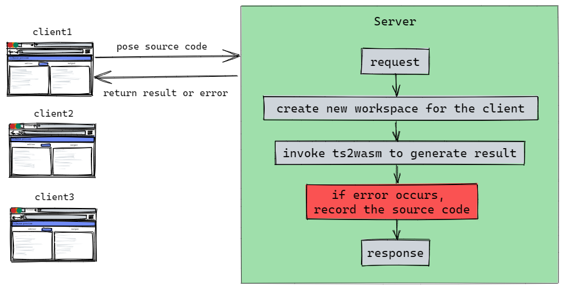

# ts2wasm playground

This project is a self hosted server to expose ts2wasm capability through web page, the aim is to:
1. Provide technical preview
2. Collect more test cases

## Requirement

- A web based UI for users to edit and compile their source code
- Support multiple users access at the same time
- Collect source files which cause unexpected errors

## User interface


## Architecture


## Deployment

modify the `SERVER_IP` in `.env` to the ip of server, then execute:

``` bash
docker-compose up -d --build
```

Open the browser and navigate to http://<SERVER_IP>:3050

> Note: must use `chrome` version 111+ and enable the `WebAssembly Garbage Collection flag` in `chrome://flags/#enable-webassembly-garbage-collection`

## Inspect database

``` bash
docker inspect playground_ts2wasm-data
```

Get the Mountpoint of the volumn, and use any sqlite3 compatible tool to inspect the database file `feedback.sqlite`.
